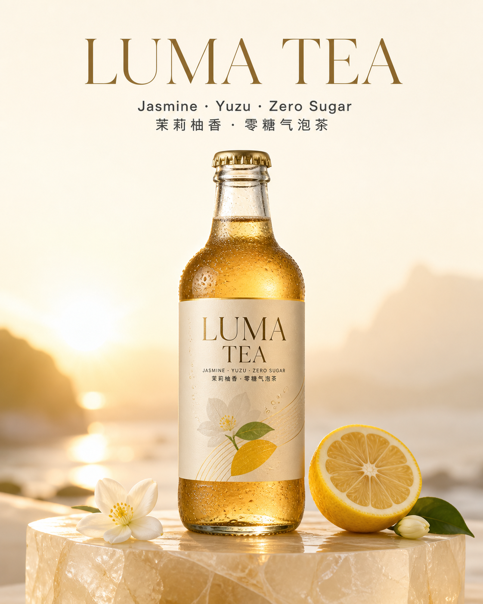
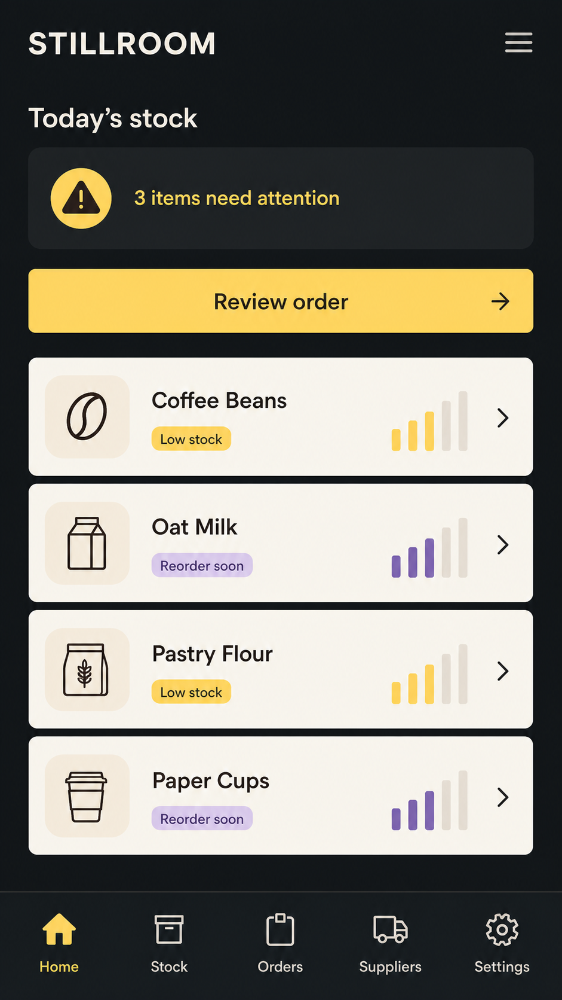
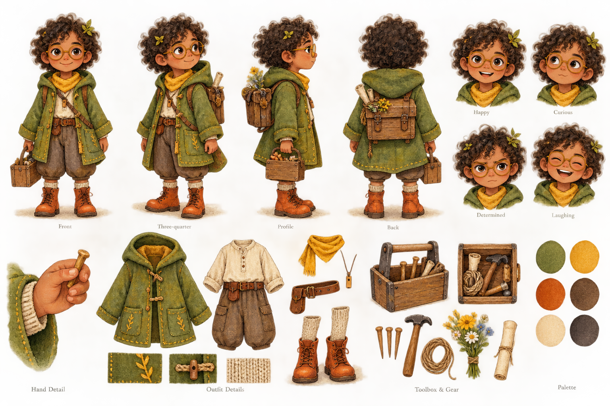
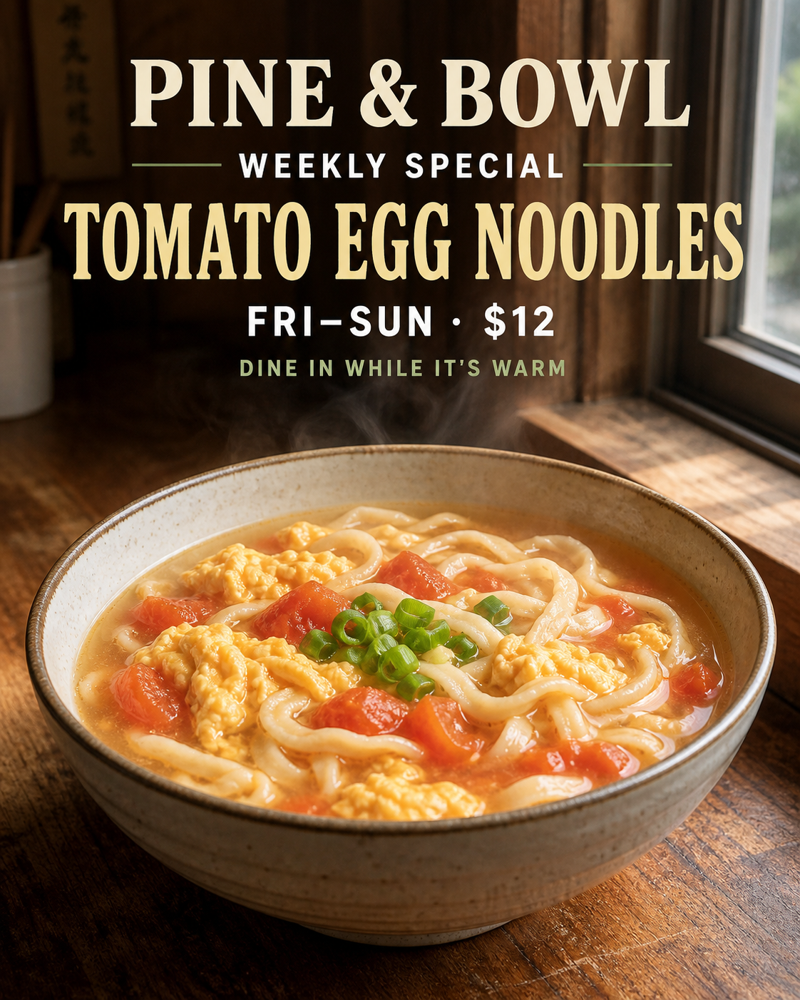

# Awesome Nano Banana Pro Prompts


[](https://awesome.re)
[](LICENSE)
[](https://ai.google.dev/gemini-api/docs/models/gemini-3-pro-image)
[](prompts/)
[](#awesome-nano-banana-pro-prompts)
[](docs/multilingual-prompting.md)

> An original, production-oriented prompt library for **Nano Banana Pro (Gemini 3 Pro Image)**, created and maintained as an open-source project by the [Flaq.ai](https://flaq.ai) team.

Build product ads, e-commerce images, multilingual posters, infographics, UI concepts, storyboards, character systems, social content, local-business campaigns, and precision edits. Every recipe in this repository was written for this project from scratch and is designed around Nano Banana Pro's strengths: complex instruction following, accurate in-image text, real-world grounding, reference-image composition, localization, and high-resolution professional output.

**README languages:** [English](README.md) · [简体中文](README_zh-CN.md) · [繁體中文](README_tw.md) · [日本語](README_ja.md) · [한국어](README_ko.md) · [Español](README_es.md) · [Français](README_fr.md) · [Deutsch](README_de.md) · [Português](README_pt.md) · [Italiano](README_it.md) · [Русский](README_ru.md) · [العربية](README_ar.md) · [ไทย](README_th.md) · [Bahasa Indonesia](README_id.md) · [Tiếng Việt](README_vi.md)

[Prompt guide](docs/prompting-guide.md) · [Multilingual guide](docs/multilingual-prompting.md) · [API quick start](docs/api-quickstart.md) · [Contribute](CONTRIBUTING.md)

## Why this library is useful

- **100 original prompt recipes:** practical briefs instead of vague style fragments.
- **15 README languages:** localized entry points for a global creator and developer community.
- **20 production categories:** marketing, commerce, education, UI, storytelling, architecture, fashion, publishing, games, history, editing, business, and more.
- **Nano Banana Pro-native patterns:** role-labelled reference images, locked edit invariants, exact text blocks, localization, grounding, and multi-turn refinement.
- **Multilingual by design:** examples and localization workflows for English, Simplified Chinese, Traditional Chinese, Japanese, Korean, Spanish, French, and German.
- **Commercial workflow notes:** aspect ratios, typography, safe zones, output QA, iteration instructions, and platform-specific adaptations.
- **Clear provenance:** no scraped prompt dump, no removed attribution, and no third-party example images presented as ours.

## Model snapshot

Facts below were checked against Google's documentation on **August 28, 2026**. Product behavior can change, so verify the linked documentation before building a production pipeline.

| Capability | Nano Banana Pro |
|---|---|
| Official model ID | `gemini-3-pro-image` |
| Best fit | Professional asset production and complex instructions |
| Output sizes | 1K, 2K, and up to 4K |
| Reference composition | Up to 14 inputs in supported workflows |
| High-fidelity objects | Up to 6 object reference images |
| Character consistency | Up to 5 people |
| Style references | Up to 3 images |
| Text and localization | Advanced multilingual text rendering and in-image translation |
| Knowledge | Google Search grounding is supported |
| Provenance | Generated images include SynthID |

Official reading: [model card](https://ai.google.dev/gemini-api/docs/models/gemini-3-pro-image), [image generation guide](https://ai.google.dev/gemini-api/docs/image-generation), and [Google's prompt tips](https://blog.google/products-and-platforms/products/gemini/prompting-tips-nano-banana-pro/).

## Start in 60 seconds

1. Choose a recipe from the library.
2. Replace every value in `{{double_braces}}`.
3. Attach reference images in the exact order declared by the prompt.
4. Paste the prompt into Gemini, Google AI Studio, or your Gemini API workflow.
5. Check spelling, identities, product geometry, factual claims, and cropping.
6. Refine one variable at a time; repeat the locked constraints on every edit.

### Universal prompt skeleton

```text
GOAL
Create {{asset_type}} for {{audience}} and {{channel}}.

CONTENT
Subject: {{who_or_what}}
Action: {{what_is_happening}}
Environment: {{location_or_background}}
Message: {{single_communication_goal}}

VISUAL DIRECTION
Medium/style: {{photography_illustration_3d_ui_or_other}}
Composition: {{shot_size_camera_angle_subject_placement}}
Lighting/color: {{lighting_mood_palette}}
Format: {{aspect_ratio_and_output_size}}

TEXT — RENDER VERBATIM
Headline: "{{exact_headline}}"
Supporting text: "{{exact_supporting_text}}"
Do not add, translate, paraphrase, or repeat any text.

REFERENCE IMAGES
Image 1: {{identity_product_or_base_scene_role}}
Image 2: {{style_pose_logo_or_material_role}}

LOCKED CONSTRAINTS
Preserve {{identity_geometry_layout_brand_colors_or_other_invariants}}.
Change only {{explicit_edit_scope}}.
No extra logos, marks, objects, labels, or decorative copy.

QUALITY CHECK BEFORE FINALIZING
Verify text character by character; verify hands and object count; verify factual labels;
keep important content inside the safe area; return one polished final image.
```

The detailed explanation, retry patterns, and quality checklist live in the [Nano Banana Pro prompting guide](docs/prompting-guide.md).

## Prompt library

| Collection | What you can make | Recipes |
|---|---|---:|
| [Brand & advertising](prompts/01-brand-and-advertising.md) | Campaign key visual, outdoor ad, launch poster, brand system | 5 |
| [E-commerce & product](prompts/02-ecommerce-and-product.md) | Hero packshot, comparison board, exploded view, lifestyle scene | 5 |
| [Social & creator content](prompts/03-social-and-creator.md) | Thumbnail, carousel, podcast cover, event post, quote card | 5 |
| [Infographics & education](prompts/04-infographics-and-education.md) | Process diagram, science explainer, map, timeline, recipe card | 5 |
| [UI, app & web design](prompts/05-ui-app-and-web.md) | Mobile UI, dashboard, landing page, wireframe, design system | 5 |
| [Characters, comics & storyboards](prompts/06-characters-and-storytelling.md) | Character sheet, comic, children's page, storyboard, scene continuation | 5 |
| [Photography & editorial](prompts/07-photography-and-editorial.md) | Portrait, food, travel, architecture, magazine spread | 5 |
| [Editing, localization & compositing](prompts/08-editing-and-localization.md) | Object edit, translation, relighting, background, multi-image composite | 5 |
| [Business & productivity](prompts/09-business-and-productivity.md) | Pitch slide, report cover, workflow, roadmap, dashboard summary | 5 |
| [Local business campaigns](prompts/10-local-business-campaigns.md) | Restaurant, retail, fitness, real estate, tourism | 5 |
| [Style lab](prompts/11-style-lab.md) | Isometric, clay, watercolor, paper craft, pixel art | 5 |
| [Architecture, interiors & real estate](prompts/12-architecture-interiors-and-real-estate.md) | Floor-plan visualization, renovation, retail, axonometric, facade | 5 |
| [Fashion, beauty & lookbooks](prompts/13-fashion-beauty-and-lookbooks.md) | Lookbook, beauty macro, try-on, colorway, runway editorial | 5 |
| [Travel, landscapes & vehicles](prompts/14-travel-landscapes-and-vehicles.md) | Weather, road trip, vehicle concept, aerial guide, transit poster | 5 |
| [Animals, creatures & botanicals](prompts/15-animals-creatures-and-botanicals.md) | Wildlife, pets, creature anatomy, botanical plate, ecosystem | 5 |
| [Typography, logos & editorial](prompts/16-typography-logos-and-editorial.md) | Type specimen, logo system, cover, lettering, wayfinding | 5 |
| [Game assets, 3D & industrial](prompts/17-game-assets-3d-and-industrial.md) | Sprites, modular kits, item atlas, cutaway, gameplay HUD | 5 |
| [History, culture & heritage](prompts/18-history-culture-and-heritage.md) | Period scene, museum panel, scroll, artifact, craft | 5 |
| [Documents & publishing](prompts/19-documents-and-publishing.md) | White paper, manual, reference plate, annual report, workbook | 5 |
| [Profiles, teams & lifestyle](prompts/20-profiles-teams-and-lifestyle.md) | Headshot, team portrait, persona, avatars, remote mosaic | 5 |

## Original scene gallery

These newly created project illustrations show the range of assets covered by the library. They are visual references, **not claimed as Nano Banana Pro benchmark outputs**; full provenance is recorded in [assets/README.md](assets/README.md).

| Multilingual product poster | Educational infographic |
|---|---|
|  |  |
| Mobile app UI | Character anchor sheet |
|  |  |
| Local restaurant campaign |  |
|  |  |

## Five high-value recipes to try first

### 1. Multilingual product launch poster

```text
Create a premium 4:5 launch poster for a fictional sparkling tea named "LUMA TEA".
Show one chilled amber glass bottle on a translucent stone pedestal, condensation visible,
with jasmine flowers and sliced yuzu arranged sparingly. Warm sunrise backlight, refined
editorial product photography, ivory and amber palette, generous breathing room.

Render exactly these three lines, once each:
"LUMA TEA"
"Jasmine · Yuzu · Zero Sugar"
"茉莉柚香 · 零糖气泡茶"

Use an elegant high-contrast serif for the brand name and a clean sans-serif for supporting
copy. Keep English and Chinese optically balanced. Do not invent ingredients, certifications,
prices, logos, or fine print. Check every Latin letter and Chinese character before finalizing.
```

### 2. Factual educational infographic

```text
Create a 16:9 classroom infographic titled "HOW A HEAT PUMP MOVES HEAT" for homeowners.
Use a clean cutaway house diagram with four numbered stages: 1 EVAPORATE, 2 COMPRESS,
3 CONDENSE, 4 EXPAND. Show outdoor air, refrigerant loop, indoor coil, compressor, and
directional arrows. Use red arrows for released heat and blue arrows for absorbed heat.

Keep the explanation conceptual, not an installation schematic. Do not invent performance
figures. If Search grounding is enabled, verify terminology with authoritative energy sources.
Render only the supplied labels, with large accessible type and high contrast.
```

### 3. Five-person editorial composite

```text
Image 1–5: identity references for five different adults.
Image 6: wardrobe palette reference.
Image 7: architectural location reference.

Create a cinematic 3:2 editorial group portrait in the courtyard shown in Image 7. Preserve
the identity, age, skin tone, hair, and distinguishing facial features of all five people.
Dress them in coordinated but non-identical outfits derived from Image 6. Arrange them at
different depths with natural interaction and realistic eye lines. Match perspective, color
temperature, contact shadows, and grain across every person. Do not merge faces, duplicate
people, change apparent age, or add accessories. No text or logos.
```

### 4. Localized menu without layout drift

```text
Image 1: source cafe menu.

Create a Spanish-language edition of Image 1. Replace only the menu text. Preserve the exact
grid, item order, illustrations, prices, currency, colors, paper texture, margins, type hierarchy,
and logo placement. Translate meaning naturally for a Latin American audience, but do not
translate the brand name or legally required marks. Prevent overflow by adjusting line breaks
and font size minimally. Before finalizing, compare every price and item one by one against
Image 1. Change nothing outside the text areas.
```

### 5. Character-consistent story continuation

```text
Image 1: approved character anchor.
Image 2: approved watercolor style reference.

Continue the same original character in a new children's-book scene: at dawn, the character
repairs a tiny footbridge for forest animals after a storm. Preserve facial structure, hairstyle,
body proportions, outfit construction, signature colors, and watercolor brush behavior from
the references. Wide 3:2 composition, clear silhouette, gentle morning fog, readable action,
space at the top for later typesetting. Do not redesign the character, add text, or imitate a
named living artist.
```

## A workflow that produces better results

```text
brief → draft prompt → first image → defect list → single-variable edit → localization → export QA
```

- **Draft:** solve composition and subject before polishing tiny details.
- **Defect list:** name observable problems, not vague dissatisfaction.
- **Single-variable edit:** change one category at a time—copy, lighting, crop, pose, or material.
- **Localization:** translate from the approved master while locking layout and numeric data.
- **Export QA:** verify text, identity, factual claims, safe zones, resolution, and provenance.

## Multilingual prompting

Nano Banana Pro can render and localize text in multiple languages, but a good workflow still treats copy as data:

- put exact copy in its own block;
- declare what may and may not be translated;
- protect names, numbers, SKUs, prices, URLs, and legal marks;
- specify locale, not just language (`es-MX`, `pt-BR`, `zh-TW`);
- ask for native line breaks instead of literal word-for-word spacing;
- proofread with a native speaker before publishing.

Copy-ready patterns for eight locales are in [docs/multilingual-prompting.md](docs/multilingual-prompting.md).

## Responsible use and originality

This is an **independent community resource**, not an official Google project. “Nano Banana Pro” and “Gemini” are product names belonging to their respective owner.

- All prompt text in this repository is original to this project.
- Do not submit scraped prompts, unattributed community work, or images you do not have the right to share.
- Style descriptions should use visual properties and art movements; avoid requests to clone a living artist's signature style.
- Get consent before using a person's likeness and do not create deceptive identity edits.
- Verify medical, legal, financial, scientific, historical, and current-event content with authoritative sources.
- Preserve SynthID and follow the terms of the service you use.

The repository's cover and scene images are newly created project illustrations. They are not presented as official model benchmarks; see [assets/README.md](assets/README.md) for provenance.

## Contributing

Contributions are welcome if they add a reproducible use case and pass the originality checklist. Read [CONTRIBUTING.md](CONTRIBUTING.md), use the repository prompt schema, and include a rights-safe example image only when you created it or have explicit permission to publish it.

## Nano Banana Pro prompt FAQ

### What is Nano Banana Pro?

Nano Banana Pro is Google's name for Gemini 3 Pro Image, model ID `gemini-3-pro-image`. It is intended for professional image generation and editing tasks that benefit from complex reasoning, text rendering, localization, reference images, world knowledge, and precise creative control.

### What is the best Nano Banana Pro prompt structure?

Start with the asset's function, then define layout, content and reference roles, and finish with quality locks. Put exact in-image copy in a separate verbatim block. For edits, explicitly say what changes and what must remain unchanged.

### Can Nano Banana Pro generate Chinese, Japanese, Korean, and other languages inside images?

It supports multilingual text rendering and localization. Results still need human proofreading. Specify the locale, provide approved copy, protect names and numeric data, and ask the model to preserve hierarchy while using natural line breaks for the target writing system.

### How many reference images can I use?

Google documents workflows with up to 14 reference images for Gemini 3 image models. Nano Banana Pro documentation lists up to six high-fidelity object images, up to five people for character consistency, and up to three style references. Limits can vary by product surface.

### Does a detailed prompt guarantee accurate text and facts?

No. Better structure improves reliability, but generated text, diagrams, identities, and factual content can still be wrong. Proofread every final image, use authoritative sources or grounding where appropriate, and treat high-stakes visuals as drafts until reviewed by a qualified person.

### Can I use these Nano Banana Pro prompts commercially?

The original repository text is MIT-licensed, but your output rights also depend on the model service terms, your reference-image rights, brand and likeness permissions, and the laws that apply to your use. Review those requirements before publishing or selling generated work.

## About Flaq.ai

This open-source project is produced and maintained by the [Flaq.ai](https://flaq.ai) team. Flaq.ai provides a unified, agent-ready API layer and creative workspace for image, video, language, multimodal, and safety models.

Teams can use Flaq.ai to explore models, compare practical capabilities, prototype creative workflows, and move successful experiments into applications or production pipelines without building a separate integration for every provider. Typical uses include:

- AI agents and automated content-production workflows;
- text-to-image, image editing, text-to-video, and image-to-video generation;
- product visuals, advertising creatives, thumbnails, social assets, and branded content;
- model evaluation, API integration, education, and workflow tutorials.

Useful links: [try Nano Banana Pro on Flaq.ai](https://flaq.ai/models/google/nano-banana-pro/) · [explore the AI model market](https://flaq.ai/model-market/) · [read the API documentation](https://flaq.ai/docs/).

## Earn with the Flaq.ai Affiliate Program

Developers, agent builders, creators, reviewers, educators, and AI communities can join the [Flaq.ai Affiliate Program](https://flaq.ai/affiliate-program/), create referral links, recommend relevant Flaq.ai tools and APIs, and earn commission from eligible referred orders.

- **20% commission** on a referred user's first valid paid order;
- **10% commission** on following valid paid orders made within 60 days after registration;
- referral links and activity are managed from the affiliate workspace;
- tutorials, model comparisons, API guides, courses, communities, and practical creative workflows are suitable promotion channels.

Eligibility, attribution, refunds, chargebacks, risk review, payout readiness, and final commission are governed by the active affiliate policy and agreement. Check the [official affiliate page](https://flaq.ai/affiliate-program/) before publishing promotional content.

## License

Code and original written material are released under the [MIT License](LICENSE). Generated images may also be subject to the terms of the model or service used to create them. Third-party product names remain the property of their owners.
