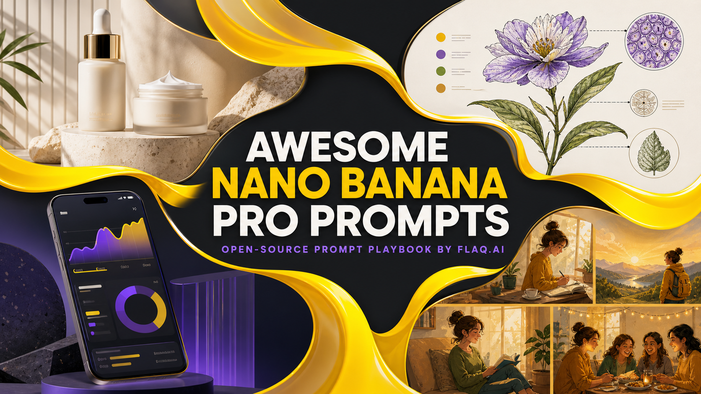

# Awesome Nano Banana Pro Prompts 한국어판

> [Flaq.ai](https://flaq.ai) 팀이 제작하고 관리하는 Nano Banana Pro(Gemini 3 Pro Image) 실무형 오픈소스 프롬프트 라이브러리입니다.

**README 언어:** [English](README.md) · [简体中文](README_zh-CN.md) · [繁體中文](README_tw.md) · [日本語](README_ja.md) · [한국어](README_ko.md) · [Español](README_es.md) · [Français](README_fr.md) · [Deutsch](README_de.md) · [Português](README_pt.md) · [Italiano](README_it.md) · [Русский](README_ru.md) · [العربية](README_ar.md) · [ไทย](README_th.md) · [Bahasa Indonesia](README_id.md) · [Tiếng Việt](README_vi.md)

[프롬프트 목록](prompts/) · [프롬프트 가이드](docs/prompting-guide.md) · [다국어 가이드](docs/multilingual-prompting.md) · [API 빠른 시작](docs/api-quickstart.md)

## 무엇을 제공하나요?

브랜드 광고, 이커머스, 소셜 콘텐츠, 인포그래픽, UI, 캐릭터, 사진, 건축, 패션, 여행, 동식물, 타이포그래피, 게임, 역사·문화, 출판, 정밀 편집과 현지화를 위한 **20개 카테고리, 100개의 독창적인 레시피**를 제공합니다.

각 레시피에는 결과물의 목적, 화면 구성, 참조 이미지 역할, 이미지에 표시할 정확한 문구, 변경 금지 조건과 최종 품질 검사가 포함됩니다. 외부 커뮤니티 프롬프트를 복사하거나 출처를 지운 모음이 아닙니다.

## 빠른 사용법

1. [프롬프트 목록](prompts/)에서 최종 결과물에 맞는 레시피를 고릅니다.
2. `{{변수}}`를 실제 브랜드, 대상, 문구와 형식으로 바꿉니다.
3. 프롬프트에서 지정한 순서대로 참조 이미지를 첨부합니다.
4. Gemini, Google AI Studio 또는 Gemini API에서 생성합니다.
5. 맞춤법, 숫자, 얼굴, 제품 구조, 사실과 안전 영역을 검토합니다.
6. 한 번에 한 가지 문제만 수정하고 고정 조건을 반복합니다.

한국어 텍스트는 승인된 문구를 그대로 제공하고, 한글 음절 조합, 띄어쓰기, 조사, 문장부호, 숫자와 단위, 줄바꿈을 게시 전에 직접 교정하세요.

## Flaq.ai 소개

[Flaq.ai](https://flaq.ai)는 이미지, 영상, 언어, 멀티모달 및 안전 모델을 위한 통합 Agentic API와 크리에이티브 워크스페이스를 제공합니다. 여러 모델을 비교하고, 이미지와 영상을 시험 제작하고, 검증된 워크플로를 애플리케이션·자동화·AI Agent에 연결할 수 있습니다.

[Flaq.ai에서 Nano Banana Pro 사용](https://flaq.ai/models/google/nano-banana-pro/) · [AI 모델 마켓](https://flaq.ai/model-market/) · [API 문서](https://flaq.ai/docs/)

## Flaq.ai 제휴 프로그램

개발자, Agent 제작자, 크리에이터, 리뷰어, 교육자와 AI 커뮤니티는 [Flaq.ai Affiliate Program](https://flaq.ai/affiliate-program/)에 참여하여 추천 링크의 적격 주문에서 수수료를 받을 수 있습니다.

- 추천 사용자의 첫 유효 유료 주문: **20%**
- 가입 후 60일 이내의 후속 유효 유료 주문: **10%**
- 제휴 워크스페이스에서 링크와 활동 관리

자격, 귀속, 환불, 차지백, 위험 검토와 지급은 최신 공식 정책 및 계약을 따릅니다. 홍보 전에 [공식 페이지](https://flaq.ai/affiliate-program/)를 확인하세요.

## 라이선스

독창적인 문서와 코드는 [MIT License](LICENSE)로 제공됩니다. 생성 결과에는 사용한 모델 서비스 약관과 입력 자료의 권리도 적용될 수 있습니다.
